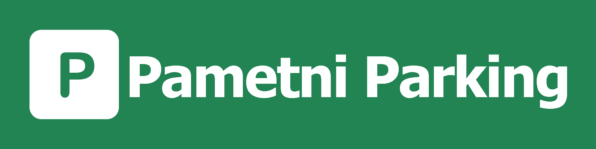

# Pametni Parking - Objektno orijentisana analiza i dizajn (2025/2026)



## Osiguraj svoje mjesto. Uštedi vrijeme. Parkiraj bez stresa.

## Opis projekta: 
#### Pametni Parking Sistem omogućava korisnicima pregled dostupnih parking mjesta, kreiranje i upravljanje rezervacijama, online plaćanje rezervacija te primanje email obavijesti. Sistem podržava različite korisničke uloge i administraciju parking sistema.

## Razvojni tim: 
```text
- Sara Bajrić (@sbajric2)
- Irma Hamzić (@ihamzic1)
- Nejla Hadžikić (@nhadizkic)
- Ajša Karabegović (@kajsa1)
```

## Deployment: 

[Aplikaciji možete pristupiti ovdje](http://kajsa1-001-site1.mtempurl.com)

## Testni računi

| Uloga | Email | Lozinka |
|--------|--------|----------|
| Korisnik   | korisnik@gmail.com   | korisnik123   |
| Operater   | radnik@gmail.com   | radnik123   |
| Administrator   | admin@parking.ba   | Admin123!   |

## Konfiguracija baze
Konekcijski string: 
```text
{
  "ConnectionStrings": {
    "DefaultConnection": "Server=sql6034.site4now.net;Database=db_ac8e23_ooad2026;User Id=db_ac8e23_ooad2026_admin;Encrypt=True;TrustServerCertificate=True;"
    }
}
```
